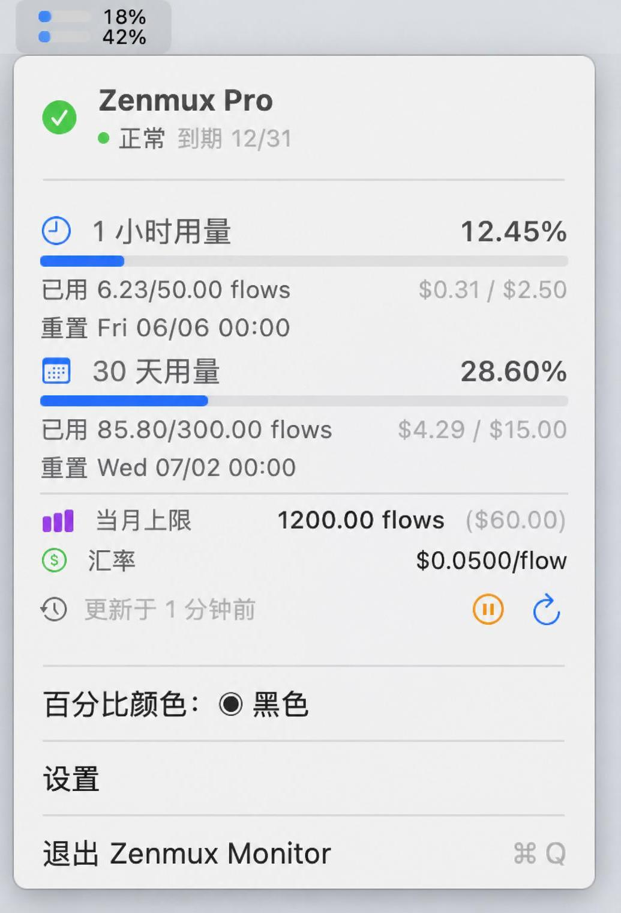

# Zenmux Monitor

macOS 菜单栏小程序，实时显示 [Zenmux](https://zenmux.ai) API 用量配额。

## 功能

- **双进度条**：菜单栏直接显示 5 小时 / 7 天滚动窗口用量，颜色随用量变化（蓝→橙→红），带精确百分比
- **下拉详情**：点击菜单栏图标展开完整用量面板（flows、USD、汇率、月度上限、到期时间）
- **条件刷新**：仅在指定 App（VS Code / Cursor / PyCharm 等）运行时才请求 API，空闲时零网络开销
- **自定义 App 列表**：设置中自由选择/添加哪些 App 触发刷新
- **始终刷新模式**：可选忽略 App 检测，全天候监控
- **百分比颜色切换**：菜单内一键切换百分比文字为白色或黑色
- **暂停/继续**：菜单内一键暂停或恢复自动刷新
- **本地设置保存**：API Key 与所有配置持久化在应用本地
- **纯菜单栏运行**：无 Dock 图标，无窗口，极低资源占用

## 截图



> 截图仅为软件界面示意，图中数据均为虚例。

## 安装

1. 从 [Releases](../../releases) 下载 `zenmux-monitor.zip`
2. 解压后拖 `zenmux-monitor.app` 到 `/Applications`
3. 首次打开：**右键 App → 打开**（Ad Hoc 签名需绕过 Gatekeeper）
4. 之后可在系统设置 → 通用 → 登录项 中设为开机自启

## 配置

1. 点击菜单栏图标 → **设置**
2. 前往 [Zenmux 控制台](https://zenmux.ai/platform/management) 创建 **Management API Key**
3. 粘贴到设置窗口 → 保存
4. （可选）勾选需监控的 AI 编码工具
5. （可选）添加自定义 App 的 Bundle ID

## 系统要求

- macOS 15.0+
- Apple Silicon / Intel（通用二进制）

## 资源占用

- 内存：空闲 ~20MB，菜单打开时 ~30MB
- CPU：空闲时 < 0.1%，无轮询时 ≈ 0%
- 网络：仅监控 App 运行时每 60s 一次小请求

## 开发

```bash
git clone https://github.com/zenmux/monitor.git
cd monitor
open zenmux-monitor.xcodeproj
```

Cmd+R 运行，Cmd+B 编译。

## License

MIT
